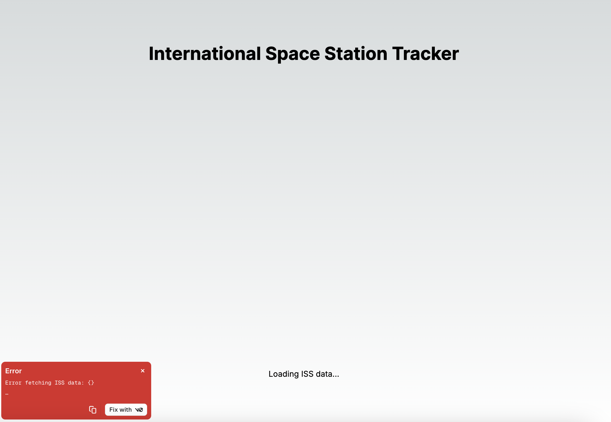
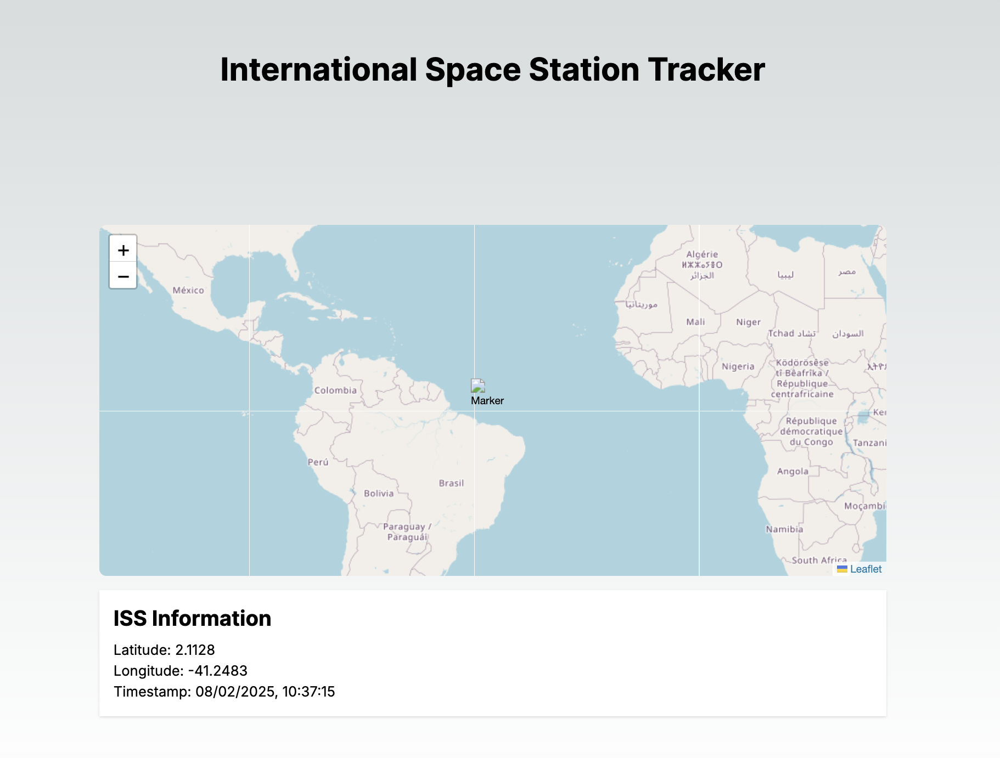
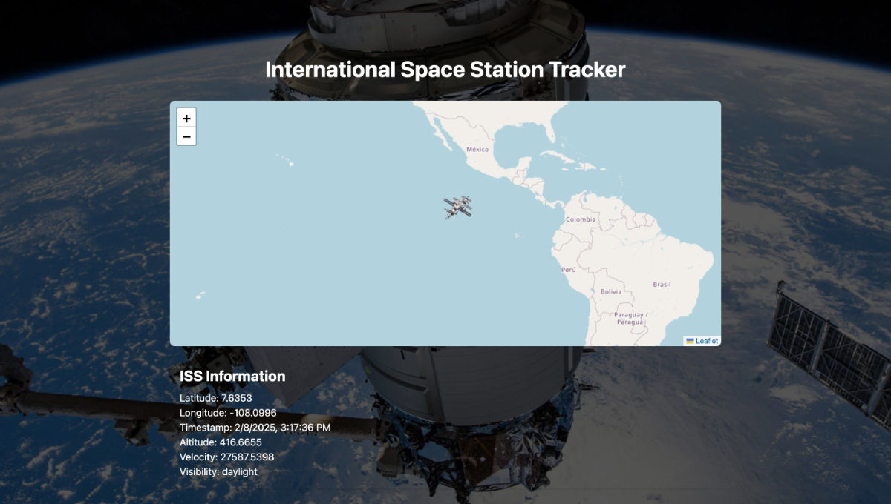

# WhereTF_Is_ISS

A simple app to track the location of the international space station since we are pretty bad at doing that with the naked eye... we will test how [Vercel's v0](https://v0.dev/) manages to scaffold and build the project

## Running the project

Run the development server:

```bash
npm i
```

then

```bash
npm run dev
```

Open [http://localhost:3000](http://localhost:3000) with your browser to see the result.

# Process

## Step 1: scaffolding with v0

Our objective was to make v0 build our app for us, and make fixes where needed to achieve a decent outcome

We brainstormed how we as humans might go about displaying the data and came up with these ideas:

- Charting ISS on a map
- AR assisted location with a phone
- A location card of the nearest city on Earth that the ISS is now hovering over

And decided that, if v0 doesn't give us a good result, we will negotiate with it towards the "Charting ISS on a map" approach.

This was our initial prompt for v0:

```
I want to build an app that shows me where the International Space Station is at any given time. The data I get from the API Looks like this:

{"name":"iss","id":25544,"latitude":49.324938069575,"longitude":42.297945225015,"altitude":424.45270385567,"velocity":27582.321250976,"visibility":"daylight","footprint":4530.0477985004,"timestamp":1738999379,"daynum":2460714.8076273,"solar_lat":-14.882332574028,"solar_lon":72.791671453219,"units":"kilometers"}
```

v0 provided us with initial codebase, but couldn't give us a preview of what to expect:


But we could see that v0 went with the "Charting ISS on a map" approach, because the code it generated uses [leaflet](https://github.com/Leaflet/Leaflet).

## Step 2: agreeing/disagreeing with v0

v0 told us after generating the code:

"Note that the API used in this example ([http://api.open-notify.org/iss-now.json](http://api.open-notify.org/iss-now.json)) doesn't provide all the information you mentioned in your initial data structure. If you have access to an API that provides more detailed information (like altitude, velocity, and visibility), you can update the `fetchISSData` function in the `ISSTracker` component to use that API and display the additional information."

So we updated the code to use the API we originally used in this project, the output of which was the data object we gave v0 to generate the code.

This solved the internal server error and we were able to see the UI created by v0:


It looks and works pretty good, aside from the broken map marker image and font color issues when viewing it in dark mode.

## Step 3: clean up and deploy

After some tweaking and adding an icon the project looked like this:


We left the `out` folder in the repository so our server can just clone the repo and deploy the directory.